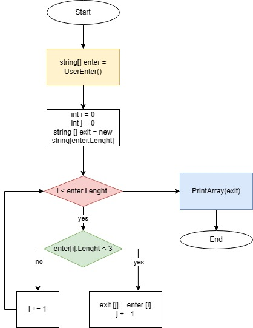

# Итоги блока. Выбор специализации
1. Создал репозиторий в GitHub.
2. Нарисовал блок-схему алгоритма для программы.

3. Снабдил репозиторий оформленным текстовым описанием решения (файлом README.md)
4. Написал программу решающую задачу (из имеющегося массива строк, формирует массив меньше или рfоно 3)
5. Использовал контроль версий.

## Принцип работы программы
#

* **У пользователя спрашивается количество строк, которые он введёт**
* **Создается массив на это количество ячеек**
* **В цикле пользователь вводит следующую строку**
* **По окончании цикла создается выходной массив, равный по длине исходному, и ещё один счётчик**
* **Запускается цикл на проверку длины строки(если длина меньше 4, то переносится в новый массив, если нет - пропускается)**
* **С помощью функции новый массив выводится на экран(пустые элементы не печатаются)**